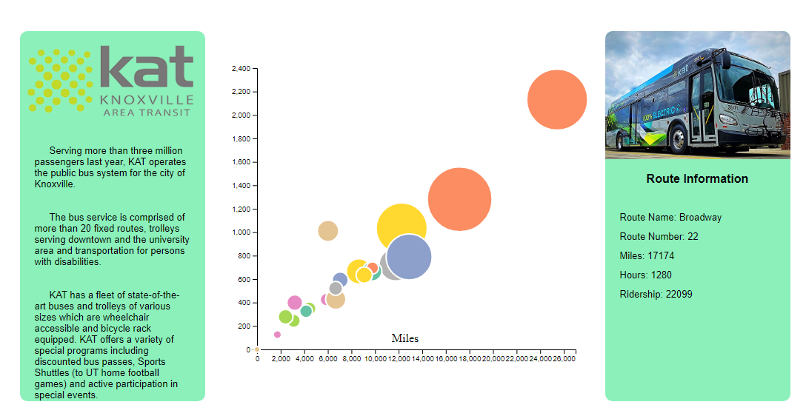
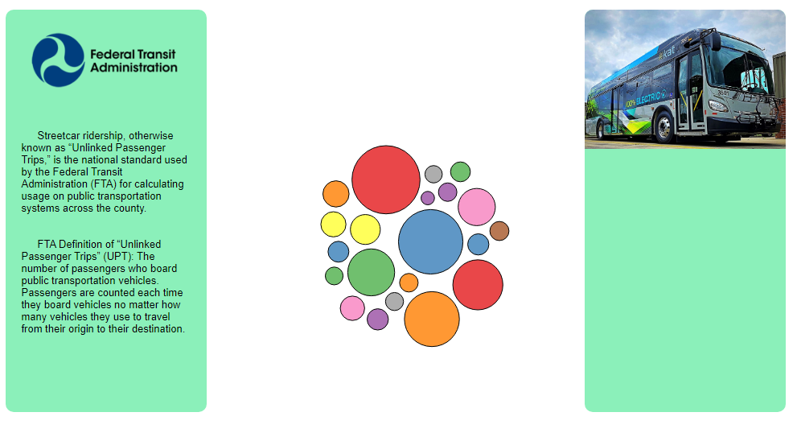
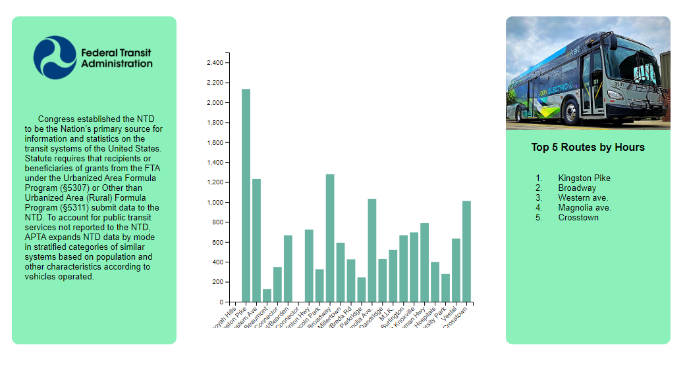

# Knoxville Area Transit Ridership Visualization

## Overview and Motivation

Public transportation in the United States falls sevierly behind every other developed nation. 
With the ridership data provided by the city of Knoxville I plan on mapping out hot spots on the map
that represent high traffic area. With that data I will then be able to devise a plan that allows Knoxville to create transportation 
access that is more frequent, used more, and reduces traffic. In addition to showing current residence where they could reach using 
public transportation methods. The usage scenerio I have envisioned is that the board of KAT will take the data for administartive 
purposes. The visualization will enable them to make informed decisions on route planning over the next 5 year of expansion through 
Knoxville. In addition the data will be great place for citizens to see an aggregate view of the public transportation opportunities in 
their community.

## Goals and Tasks
My goal in making this visualization was to take the perspective of a consulting company for the Knoxville Area Transit authority and
show Knoxville residents and the board which routes were the most useful using the metrics they collect on a monthly basis. To start the 
primary task was to transform the data into a viable format for D3. That required me to input the data from the PDF they provide board 
members every month and place it into an excel table which I could convert into a csv. Next, I needed to take that data and find 
visualization methods that would best represent them. Finally I needed to add the interconnectvitity that makes for a good data 
visualization.

## Description of Data

I will be visualizing the data provided by KAT (Knoxville Area Transit). Their data is provided in PDF format which means 
the data will be placed into a CSV. The data provided is on a month by month basis. I plan to aggragate the last months of data provided. 
With the fields: location, ridership, % change y-to-y, and revenue. 

## Visualization Design
My first visualization is a scatter plot that uses interactive circles which reveal information on where the route goes. That information
is further expanded upon with the addition of statistics on the right hand side of the chart. The second is a force graph that shows ridership in the form of circle size. This allows viewers to see right away the amount of passengers a route carried that month without having to see anything too detailed. Finally there is a bar chart which shows the passenger hours per route across all of Knoxville.

## Visualization Results

